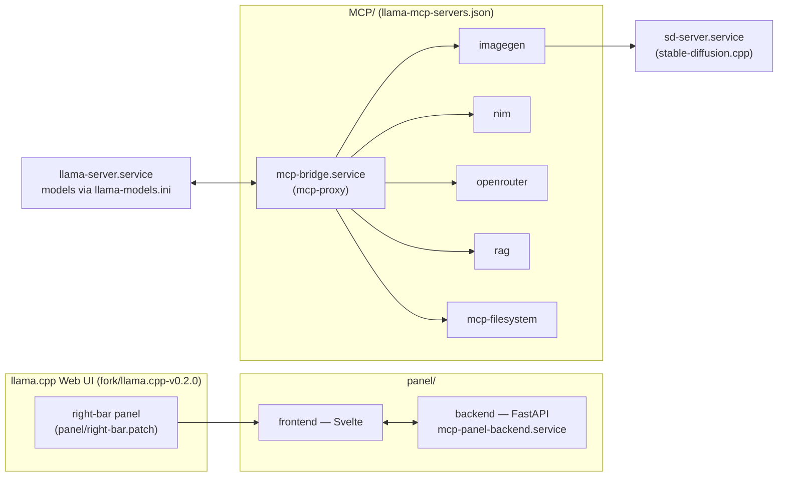

# llama-cpp-integrations

Personal MCP servers and control-panel integrations built around a local
llama.cpp setup: a router that serves multiple models, an MCP bridge that
exposes tools to its Web UI, and a custom right-bar dashboard patched into
the UI itself.

## Architecture

`llama-server` doesn't run an agent loop itself — it just hosts tools and
the models. The Web UI (or any client that drives tool calls) talks to
`mcp-bridge`, which fans out to the individual MCP servers over stdio.

## Layout

| Path | What it is |
| --- | --- |
| `MCP/` | MCP servers — `imagegen`, `nim`, `openrouter`, `rag`, `mcp-filesystem` — plus the combined `llama-mcp-servers.json` config |
| `panel/` | Svelte frontend + FastAPI backend for the right-bar panel, plus the `right-bar.patch` it's built from |
| `llama-models.ini` | Per-model `llama-server` launch config |

## Running services

| systemd `--user` unit | Purpose |
| --- | --- |
| `llama-server.service` | llama.cpp router, models via `llama-models.ini` |
| `sd-server.service` | stable-diffusion.cpp backend for the `imagegen` tool |
| `mcp-bridge.service` | `mcp-proxy`, exposes `MCP/llama-mcp-servers.json` over HTTP/SSE |
| `mcp-panel-backend.service` | Dashboard data backend for the right-bar panel |

## Not tracked here

See `.gitignore`:

- `fork/` — separate llama.cpp git checkouts (their own repos)
- `models/` — GGUF weights, downloaded separately per device
